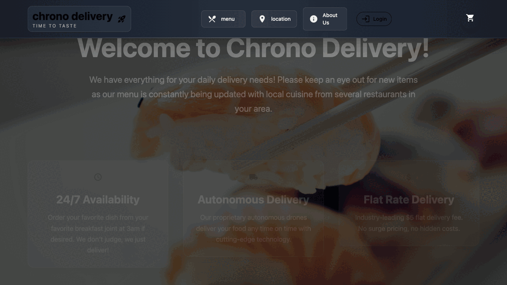

# Chrono Delivery (React Food Delivery App)

A React + TypeScript food delivery frontend with Firebase-backed menu/order data, Firebase email/password auth, animated UI components, and a cart flow.

## Tech Stack

- React 19
- TypeScript
- Vite 7
- Tailwind CSS 4
- Framer Motion
- React Router 7
- Vitest + Testing Library
- Firebase Realtime Database + Firebase Identity Toolkit API

## Current Features

- Responsive landing experience with:
1. About section
2. Menu section (fetched from Firebase)
3. Location section
- Animated desktop/mobile navigation and UI interactions with Framer Motion
- Cart system with global context and reducer
- Add, update, clear, and submit cart orders
- Firebase-backed authentication flow:
1. Sign in
2. Sign up
- Route handling:
1. `/` redirects to `/index`
2. `/index` home page
3. `/Login` login/signup page
4. `*` fallback not-found page

## Project Structure

```text
src/
  assets/                         # Static images
  components/
    cart/                         # Cart UI + cart context/reducer
    layout/                       # Layout, navbar, sections, menu domain components
    ui/                           # Shared reusable UI primitives
  functions/                      # Shared hooks (e.g. useFetch, reduced motion)
  pages/                          # Route-level pages
  private/PRIVATE.tsx             # Reads Firebase values from env
  tests/                          # Test setup
  types/                          # Shared TypeScript types
  utils/                          # Shared utilities
```

## Environment Variables

Create `.env.local` in the project root:

```bash
VITE_FIREBASE_API_KEY=your_firebase_api_key
VITE_FIREBASE_PROJECT_ID=your_firebase_project_id
```

You can copy `.env.example` as a starting point.

## Firebase Expectations

This app expects Firebase Realtime Database paths:

- `Menu.json` for menu items
- `Orders.json` for submitted orders

Menu item shape:

```json
{
  "id": "item-1",
  "name": "Sushi Roll",
  "price": 12.99,
  "description": "Fresh salmon and avocado"
}
```

## Getting Started

```bash
npm install
npm run dev
```

Default dev URL is typically `http://localhost:5173`.

## Available Scripts

- `npm run dev` start Vite dev server
- `npm run build` type-check and build production bundle
- `npm run preview` preview production build
- `npm run lint` run ESLint
- `npm run test` run Vitest in watch mode
- `npm run test:run` run tests once
- `npm run test:coverage` run tests with coverage
- `npm run test:ui` run Vitest UI

## Testing

This repo includes unit/component tests across cart, UI components, hooks, pages, and layout/navigation flows.

Run once:

```bash
npm run test:run
```

Run coverage:

```bash
npm run test:coverage
```

## Notes About Current State

- Authentication state is currently stored in-memory (`App.tsx`) and is not persisted across refresh.
- Menu and order submission rely on valid Firebase env config.
- The project is frontend-only in this repository.

## Screenshots


